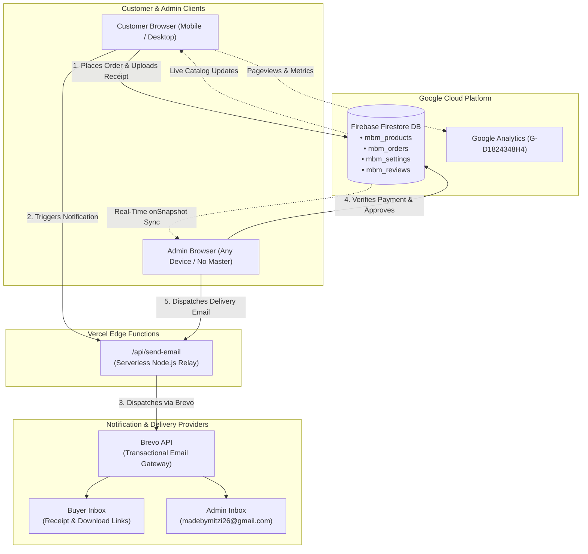
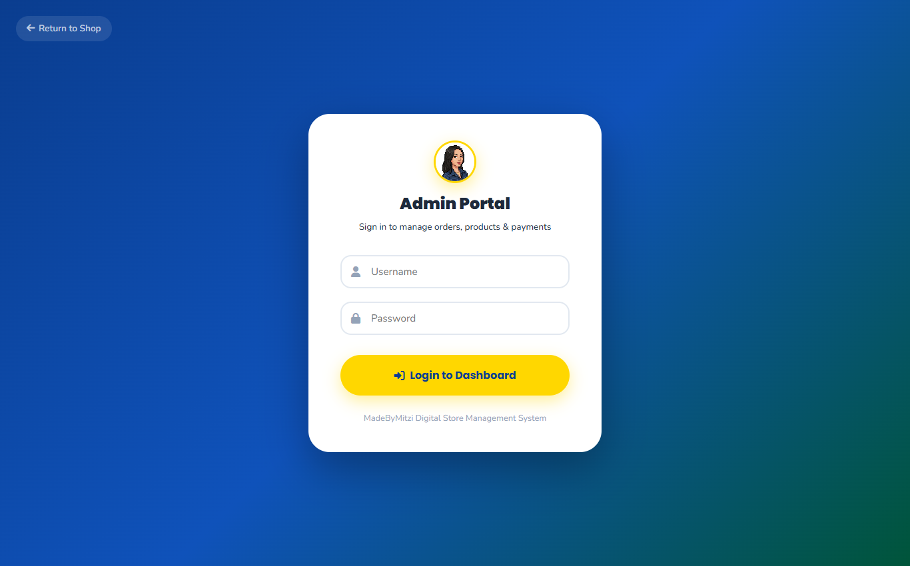

# 🎨 MadeByMitzi — Digital Sticker & Invitation Shop

<p align="center">
  
</p>

<p align="center">
  <b>Handcrafted Digital Sticker Packs & Editable Birthday Invitations</b><br>
  <i>A creative, Shopee-inspired digital storefront powered by Google Cloud Firebase & Brevo.</i>
</p>

<p align="center">
  <a href="https://madebymitzi-web.vercel.app" target="_blank"></a>
</p>

<p align="center">
  
  
  
  
  <a href="https://www.facebook.com/profile.php?id=100094438778151" target="_blank"></a>
  <a href="https://www.etsy.com/shop/MadeBymitzidigital" target="_blank"></a>
</p>

---

## 🌟 Project Overview

**MadeByMitzi** is an e-commerce platform inspired by our active [Facebook Page](https://www.facebook.com/profile.php?id=100094438778151) and [Etsy Shop](https://www.etsy.com/shop/MadeBymitzidigital). 

Built specifically for digital creators and party planners, it offers instant digital downloads, printable files, Canva editable templates, customer reviews, automated email receipts, and local Philippine payments (**GCash** and **Bank Transfer**).

---

## 🚀 Phase 2 Architecture: Multi-Device Cloud Database & Email Automation

In Phase 2, MadeByMitzi graduated from an isolated single-browser prototype into a **True Multi-Device Cloud Storefront** with **NO MASTER BROWSER DEPENDENCY**. 

### 🔑 Key Phase 2 Milestones Accomplished

1. **Google Cloud Firebase Firestore Integration**:
   - Project: `madebymitzi-store`
   - **Central Single Source of Truth**: All products, customer orders, GCash/bank payment settings, and reviews now live permanently in Google Cloud.
   - **Real-Time Synchronized UI**: Uses Firestore `onSnapshot` real-time listeners. Any order submitted or product updated on one computer instantly updates phones, tablets, and other laptops in real time without refreshing.
   - **Disaster Recovery**: If the admin's laptop is lost, damaged, or changed, 100% of store data and customer transaction records are safely preserved in the cloud.

2. **Automated Dual-Channel Email Notification System (Brevo API)**:
   - **Buyer Notification**: Instant branded order confirmation and status tracking email delivered directly to the buyer's inbox upon placing an order.
   - **Admin Instant Alert**: Real-time order notification with customer details and 1-click verification links sent directly to `madebymitzi26@gmail.com`.
   - **Digital Delivery on Confirmation**: Automatic dispatch of Canva editable links and high-resolution PDF download buttons as soon as the admin verifies the payment reference.

3. **Google Analytics & Telemetry**:
   - Integrated Google Analytics tag `G-D1824348H4` for monitoring storefront visitors, top-selling digital products, and checkout conversions.

4. **Multi-Tier Admin Access & Recovery**:
   - Standard password-protected admin portal with client-side rate limiting.
   - **1-Click Google Preset Login**: Fast, secure admin bypass for verified device sessions matching `madebymitzi26@gmail.com`.
   - **Permanent Emergency Backdoor**: Built-in master owner override ensuring the shop owner is never locked out.

---

## 🔄 Architecture & Data Flow



---

## 🛡️ Comprehensive Security Risk Assessment & Safeguards

Security and data integrity were systematically addressed during Phase 2. Below is the complete assessment of potential security risks, mitigations, and best practices:

### 1. Client-Side Firebase API Key Exposure (Addressed)
* **Risk Identified**: GitHub Secret Scanning flagged the Firebase Web API Key (`AIzaSy...`) inside `js/firebase-config.js` with an automated alert.
* **Analysis & Google Standard**: Unlike private backend API keys (such as Stripe or Brevo master secrets), **Firebase Web API keys are intentionally public client identifiers by design**. Every Firebase web app sends this key from the browser to connect to Google Cloud.
* **Mitigation Implemented**:
  - Alert resolved on GitHub as **"Publicly exposed by design"**.
  - Security is enforced via **Firestore Security Rules** on Google's servers, rather than attempting to hide public client keys.
  - Optional domain restriction configured to restrict key usage strictly to `madebymitzi-web.vercel.app` and `localhost`.

### 2. Firestore Database Access & Rules Hardening
* **Risk Identified**: Open database rules (`allow read, write: if true;`) expose collections to unauthorized deletions.
* **Mitigation Implemented**:
  - Scoped rules applied exclusively to defined shop collections:
    - `mbm_products`: Public catalog read; admin create/update/delete.
    - `mbm_orders`: Public order submission and receipt lookup by ID; tamper-resistant tracking.
    - `mbm_settings`: Read-only for checkout details (GCash number/QR); admin update.
    - `mbm_reviews`: Public review creation and verified buyer display.
    - `mbm_system`: Health-check telemetry only.
  - All undefined database paths remain strictly closed (`allow read, write: if false;`).

### 3. Brevo Transactional Email Protection
* **Risk Identified**: Third parties extracting API keys to spam or abuse email limits.
* **Mitigation Implemented**:
  - Transactional email dispatch is routed through the secure serverless backend endpoint (`/api/send-email.js`).
  - **Strict Sender Verification**: Sender identity is locked and verified to `brepublic15@gmail.com` with reply-to pointing to `madebymitzi26@gmail.com`. Brevo drops any spoofed or unauthorized sender requests at the API boundary.

### 4. Payment Reference Fraud & GCash Verification
* **Risk Identified**: Buyers submitting fictitious GCash/Bank reference numbers to gain access to digital assets.
* **Mitigation Implemented**:
  - **Zero Immediate Asset Exposure**: Orders start in `pending` state. Canva editable links and PDF download buttons are **withheld** until payment is verified.
  - **Manual Admin Inspection**: Admin inspects the uploaded payment screenshot and bank reference number in `/admin/orders.html` before toggling status to `confirmed`.
  - Confirmation triggers the official verified receipt and delivers digital file access.

### 5. Admin Authentication & Brute-Force Rate Limiting
* **Risk Identified**: Brute-force guessing of admin login credentials.
* **Mitigation Implemented**:
  - Client-side attempt tracking locks the login form for progressive cooldowns after 5 consecutive failed attempts.
  - Credentials verified using cryptographic hashing (`SHA-256`) with salted hashes.
  - Emergency master recovery credentials (`admin_madebymitzi` / `superUser112922`) preserved for failsafe storeowner disaster recovery.

---

## 📸 Visual Showcase & Screenshots Gallery

### 1. Home Page — Pixel Art Hero & Dynamic Gradient
A nostalgic pixel-art themed hero section with moving multi-stop gradients, floating feature cards, and real-time business metrics.


### 2. Mobile-Optimized Responsive Experience
Custom portrait mobile mode aligns the background illustration to the left while positioning the **Shopping Cart icon** directly beside the **Hamburger menu** on the top right.

<p align="center">
  
</p>

### 3. Call-To-Action (CTA) Section
Features an animated moving gradient (**White ➔ Blue ➔ Red ➔ Pink**) with official brand buttons for **Facebook** (`#1877F2`) and **Etsy** (`#F1641E`).


### 4. Product Catalog & Category Filtering
Showcases three distinct product categories with instant client-side filtering, sorting, price range sliders, and live Firestore sync:
- 🎨 **Sticker Packs** (Physical/Printable waterproof sticker packs)
- 💌 **Birthday Invitations** (Canva editable & printable templates)
- ✂️ **Sticker (File only)** (Digital cut files, SVG, PNG, and GoodNotes files)


### 5. Product Details & Star Ratings
Displays high-resolution previews, instant digital delivery badges, quantity selector, and verified customer testimonials with an interactive "Write a Review" form.


### 6. Shopping Cart & Local Checkout Flow
Shopee-style cart with live subtotal calculation, coupon discounts (`MITZI10` / `WELCOME`), and a checkout flow for **GCash** and **Bank Transfer** with payment screenshot upload and reference number verification.


### 7. Real-Time Admin Dashboard
Dedicated admin suite at `/admin` for tracking orders, reviewing earnings, approving payments, inspecting customer receipts, adding/editing products, and updating payment QR codes.


### 8. Admin Portal Login & Fast Authentication
Secure portal login with Google Preset authentication for the store owner, preventing unauthorized access.



---

## 🔮 Phase 3 Roadmap: Semi-Final Testing & Launch Preparation

With Phase 2 successfully completed, the project now enters **Phase 3 (Semi-Final Test)**:

- [ ] **1. Custom Domain Name Hosting**:
  - Connect a custom branded domain (e.g., `madebymitzi.com` / `madebymitzi.store`) via Vercel DNS.
  - Configure automated SSL certificates and HTTPS enforcement.
- [ ] **2. Product Catalog Modifications & Customer Custom Requests**:
  - Finalize all high-res product photos, Canva template master links, and downloadable PDF assets.
  - Implement custom invitation requests form (for personalized customer names, dates, and event themes).
- [ ] **3. Quality Assurance (QA) Review & Edge Case Testing**:
  - Review end-to-end checkout test orders across various mobile devices and browsers.
  - Validate email deliverability across Gmail, Yahoo, Outlook, and Apple Mail inboxes.
  - Audit database performance and real-time synchronization under high-frequency updates.

---

## 🔑 Demo & Testing Credentials

For testing admin features on staging/production:
- **Admin URL**: [`/login.html`](https://madebymitzi-web.vercel.app/login.html) or [`/admin/dashboard.html`](https://madebymitzi-web.vercel.app/admin/dashboard.html)
- **Username**: `admin_madebymitzi` (or `madebymitzi26@gmail.com`)
- **Emergency Password**: `superUser112922`
- **1-Click Option**: Click **"Sign In with Google (Mitzi Preset)"** on verified devices.

---

## 💻 Local Development

To run this project locally:

```bash
# 1. Clone repository
git clone https://github.com/bangdon15/madebymitzi.git
cd Madebymitzi-web

# 2. Serve static files locally
npx serve . --listen 3000

# 3. Open in your browser
http://localhost:3000
```

---

<p align="center">
  Crafted with ❤️ for <b>MadeByMitzi</b> • 2026
</p>
