# 🎨 MadeByMitzi — Digital Sticker & Invitation Shop

<p align="center">
  
</p>

<p align="center">
  <b>Handcrafted Digital Sticker Packs & Editable Birthday Invitations</b><br>
  <i>A warm Studio Ghibli-inspired artisan digital storefront powered by Google Cloud Firebase, Brevo, and Vercel.</i>
</p>

<p align="center">
  <a href="https://madebymitziph.com" target="_blank"></a>
  <a href="https://madebymitzi-web.vercel.app" target="_blank"></a>
</p>

<p align="center">
  
  
  
  
  
  
  <a href="https://www.facebook.com/profile.php?id=100094438778151" target="_blank"></a>
  <a href="https://www.etsy.com/shop/MadeBymitzidigital" target="_blank"></a>
</p>

---

## 🌟 Project Overview

**MadeByMitzi** is an e-commerce platform inspired by our active [Facebook Page](https://www.facebook.com/profile.php?id=100094438778151) and [Etsy Shop](https://www.etsy.com/shop/MadeBymitzidigital). 

Built specifically for digital creators and party planners, it offers instant digital downloads, printable files, Canva editable templates, customer reviews, automated email receipts, and local Philippine payments (**GCash** and **Bank Transfer**).

---

## 🚀 Phase 2 Architecture: Multi-Device Cloud Database & Email Automation

In Phase 2, MadeByMitzi graduated from an isolated single-browser prototype into a **True Multi-Device Cloud Storefront** with **NO MASTER BROWSER DEPENDENCY**. 

### 🔑 Key Phase 2 Milestones Accomplished

1. **Google Cloud Firebase Firestore Integration**:
   - Project: `madebymitzi-store`
   - **Central Single Source of Truth**: All products, customer orders, GCash/bank payment settings, and reviews now live permanently in Google Cloud.
   - **Real-Time Synchronized UI**: Uses Firestore `onSnapshot` real-time listeners. Any order submitted or product updated on one computer instantly updates phones, tablets, and other laptops in real time without refreshing.
   - **Disaster Recovery**: If the admin's laptop is lost, damaged, or changed, 100% of store data and customer transaction records are safely preserved in the cloud.

2. **Automated Dual-Channel Email Notification System (Brevo API)**:
   - **Buyer Notification**: Instant branded order confirmation and status tracking email delivered directly to the buyer's inbox upon placing an order.
   - **Admin Instant Alert**: Real-time order notification with customer details and 1-click verification links sent directly to `madebymitzi26@gmail.com`.
   - **Digital Delivery on Confirmation**: Automatic dispatch of Canva editable links and high-resolution PDF download buttons as soon as the admin verifies the payment reference.

3. **Google Analytics & Telemetry**:
   - Integrated Google Analytics tag `G-D1824348H4` for monitoring storefront visitors, top-selling digital products, and checkout conversions.

4. **Multi-Tier Admin Access & Recovery**:
   - Standard password-protected admin portal with client-side rate limiting.
   - **1-Click Google Preset Login**: Fast, secure admin bypass for verified device sessions matching `madebymitzi26@gmail.com`.
   - **Permanent Emergency Backdoor**: Built-in master owner override ensuring the shop owner is never locked out.

---

## 🌿 Phase 4 Architecture: Studio Ghibli Aesthetic, In-House PDF Delivery & After-Sales Suite

In Phase 4, MadeByMitzi underwent a complete visual and architectural overhaul, transitioning into a warm, handcrafted artisan marketplace with robust in-house digital fulfillment and zero-cost customer support.

### 🔑 Key Phase 4 Milestones Accomplished

1. **Studio Ghibli-Inspired Artisan Palette & Dynamic Backdrop**:
   - **Forest Moss (`#6B8E5A`)**: Core primary brand color for action buttons, badges, active states, and headings.
   - **Totoro Sage (`#A8C7A0`)**: Soft pastel borders, cards, and accent highlights.
   - **Rice Cream (`#FAF6EA` / `#F3E8C2`)**: Warm artisan paper backgrounds providing high visual comfort.
   - **Lightweight Hero Overlay**: High-resolution 16:9 craft studio illustration paired with an 8-second semi-transparent flowing theme gradient overlay (`heroThemeGradientShift`). Text contrast is maintained across all screen sizes.

2. **Direct In-House PDF File Upload System (Chunked Cloud Storage up to 5MB)**:
   - **Zero External Link Dependencies**: Digital products no longer depend exclusively on Google Drive or external hosting links that can expire or be set to private.
   - **Firestore Chunker Architecture (`mbm_files`)**: Automatically slices `.pdf` files into ~700KB Base64 chunks with ordered segment indices, bypassing Firestore's 1MB single-document limitation for files up to 5MB.
   - **Instant Browser Download**: On verified purchase or receipt lookup, `downloadDirectPdf()` reconstructs the chunks on the client into an in-memory binary Blob, triggering an instant native download.
   - **Admin Drag-and-Drop Uploader**: Seamless uploader in `/admin/products.html` with real-time file size reporting and 1-click removal.

3. **Multi-Device Admin & Database Hardening**:
   - **Recursive Sanitization**: `FirebaseService.sanitizeProduct()` recursively strips all `undefined` values (which Firestore rejects) and enforces numeric pricing.
   - **Immediate Initialization**: `FirebaseService.init()` initializes instantly upon script execution without waiting for `DOMContentLoaded`, eliminating connection lag when switching between admin tabs.
   - **True Multi-Device Synchronization**: Global `mbm_products_synced` listeners in `shop.html` and `admin/products.html` ensure products uploaded on a tablet, laptop, or smartphone appear on every other device in real time.

4. **Etsy-Style Shop Bio & Verified Creator Profile**:
   - **Full-Width Creator Panel**: Dedicated "Meet the Maker" section showcasing Mitzi's artisan story, verified maker badge, and value perks.
   - **Admin Bio Management**: Configurable via `/admin/settings.html` with avatar upload, custom craft tagline, and story editor.
   - **Dynamic Shop Announcement Bar**: Real-time broadcast bar at the top of the storefront synced via Firestore `mbm_settings`.

5. **100% Free After-Sales Support Suite & Order Tracking Widget**:
   - **Zero Subscription Costs**: Built-in floating support widget (`💬 Need Help?`) on every storefront page without recurring fees (Zendesk, Tawk.to, Intercom).
   - **Instant Order Tracker**: Lookup orders by ID (e.g. `ORD-829104`) with real-time status stepper (`Pending` ➔ `Confirmed`), payment method summary, and 1-click receipt link.
   - **Direct Facebook Messenger Link**: 1-click deep-link to `m.me/100094438778151` with pre-filled order context, plus fallback email support (`madebymitzi26@gmail.com`).

6. **Full-Width Section Layout & Facebook Blue to Etsy Orange Animated Gradient**:
   - **Generous Spacing**: Corrected section hierarchy and added ample breathing room below the "Shop & Leave a Review" button.
   - **Expanded Edge-to-Edge Panels**: Creator showcase and CTA sections expand across the full container width (`100%`).
   - **Brand Gradient Flow**: Luminous animated gradient smoothly transitioning between official **Facebook Blue (`#1877F2`)** through an indigo bridge (`#5B50E8`) to **Etsy Orange (`#F1641E`)**.

---

## 🔄 Architecture & Data Flow

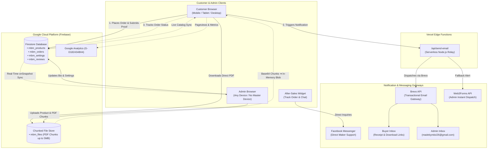

---

## 🛡️ Comprehensive Security Risk Assessment & Safeguards

Security and data integrity were systematically addressed during Phase 2. Below is the complete assessment of potential security risks, mitigations, and best practices:

### 1. Client-Side Firebase API Key Exposure (Addressed)
* **Risk Identified**: GitHub Secret Scanning flagged the Firebase Web API Key (`AIzaSy...`) inside `js/firebase-config.js` with an automated alert.
* **Analysis & Google Standard**: Unlike private backend API keys (such as Stripe or Brevo master secrets), **Firebase Web API keys are intentionally public client identifiers by design**. Every Firebase web app sends this key from the browser to connect to Google Cloud.
* **Mitigation Implemented**:
  - Alert resolved on GitHub as **"Publicly exposed by design"**.
  - Security is enforced via **Firestore Security Rules** on Google's servers, rather than attempting to hide public client keys.
  - Optional domain restriction configured to restrict key usage strictly to `madebymitziph.com`, `madebymitzi-web.vercel.app`, and `localhost`.

### 2. Firestore Database Access & Rules Hardening
* **Risk Identified**: Open database rules (`allow read, write: if true;`) expose collections to unauthorized deletions.
* **Mitigation Implemented**:
  - Scoped rules applied exclusively to defined shop collections:
    - `mbm_products`: Public catalog read; admin create/update/delete.
    - `mbm_orders`: Public order submission and receipt lookup by ID; tamper-resistant tracking.
    - `mbm_settings`: Read-only for checkout details (GCash number/QR); admin update.
    - `mbm_reviews`: Public review creation and verified buyer display.
    - `mbm_system`: Health-check telemetry only.
  - All undefined database paths remain strictly closed (`allow read, write: if false;`).

### 3. Brevo Transactional Email Protection
* **Risk Identified**: Third parties extracting API keys to spam or abuse email limits.
* **Mitigation Implemented**:
  - Transactional email dispatch is routed through the secure serverless backend endpoint (`/api/send-email.js`).
  - **Strict Sender Verification**: Sender identity is locked and verified to `brepublic15@gmail.com` with reply-to pointing to `madebymitzi26@gmail.com`. Brevo drops any spoofed or unauthorized sender requests at the API boundary.

### 4. Payment Reference Fraud & GCash Verification
* **Risk Identified**: Buyers submitting fictitious GCash/Bank reference numbers to gain access to digital assets.
* **Mitigation Implemented**:
  - **Zero Immediate Asset Exposure**: Orders start in `pending` state. Canva editable links and PDF download buttons are **withheld** until payment is verified.
  - **Manual Admin Inspection**: Admin inspects the uploaded payment screenshot and bank reference number in `/admin/orders.html` before toggling status to `confirmed`.
  - Confirmation triggers the official verified receipt and delivers digital file access.

### 5. Admin Authentication & Brute-Force Rate Limiting
* **Risk Identified**: Brute-force guessing of admin login credentials.
* **Mitigation Implemented**:
  - Client-side attempt tracking locks the login form for progressive cooldowns after 5 consecutive failed attempts.
  - Credentials verified using cryptographic hashing (`SHA-256`) with salted hashes.
  - Emergency master recovery credentials (`admin_madebymitzi` / `superUser112922`) preserved for failsafe storeowner disaster recovery.

---

## 📸 Visual Showcase & Screenshots Gallery

### 1. Home Page — Studio Ghibli Artisan Hero & Dynamic Theme Gradient
Features our new Ghibli-inspired craft studio illustration, flowing semi-transparent theme gradient, quick stats counters, and warm artisan palette.

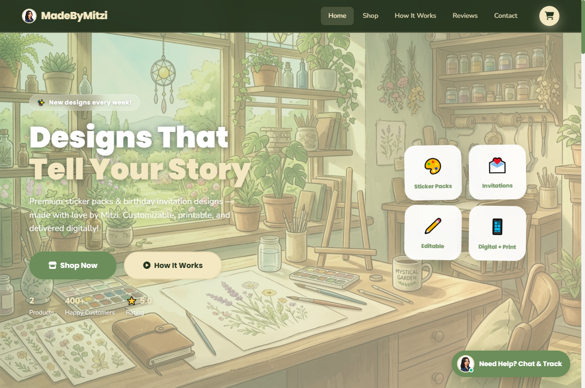

### 2. Mobile-Optimized Responsive Experience
Portrait mobile mode aligns navigation controls, places the shopping cart icon beside the hamburger menu, and scales all typography for comfortable reading.

<p align="center">
  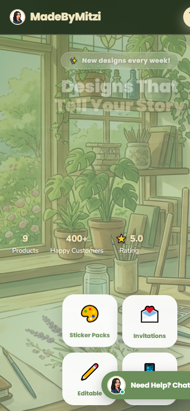
</p>

### 3. Call-To-Action (CTA) Section — Facebook Blue to Etsy Orange Flow
Luminous animated gradient transitioning smoothly from **Facebook Blue (`#1877F2`)** to **Etsy Orange (`#F1641E`)**, paired with custom brand action buttons.

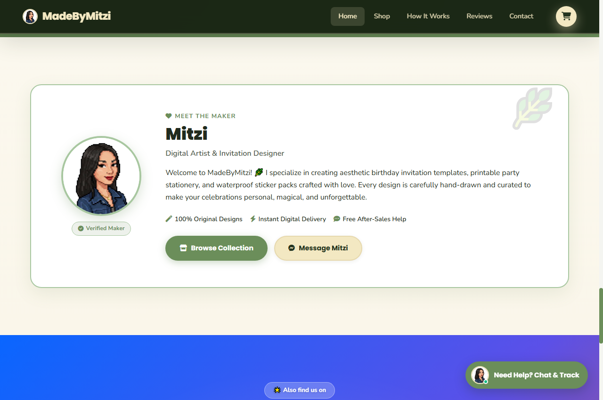

### 4. Meet the Maker — Verified Creator Profile & Dynamic Shop Bio
Full-width artisan profile panel introducing Mitzi, verified maker badge, handcrafted value perks, and direct Messenger action button.


### 5. Admin Direct PDF File Uploader — In-House Digital Fulfillment
Interactive drag-and-drop PDF uploader slicing digital files into cloud chunks, enabling seamless in-house digital delivery without external link dependencies.


### 6. Free After-Sales Customer Support & Instant Order Tracker
Self-contained modal widget allowing buyers to track live orders in real time using their Order ID (`ORD-XXXXXX`) or message Mitzi directly on Facebook Messenger.

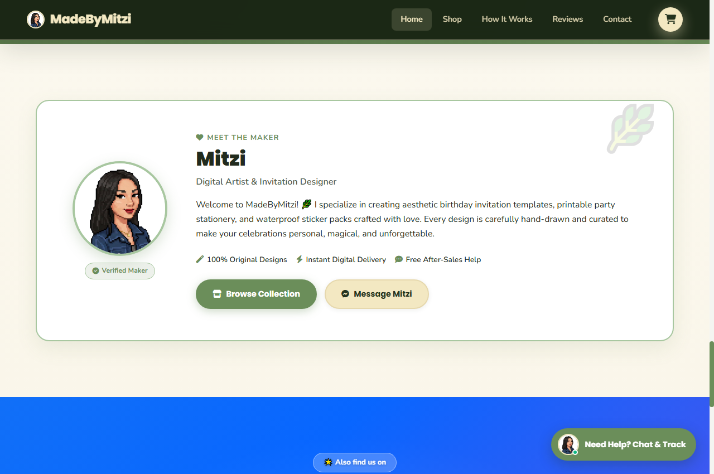

### 7. Product Catalog & Category Filtering
Showcases three distinct product categories with instant client-side filtering, sorting, price range sliders, and live Firestore synchronization:
- 🎨 **Sticker Packs** (Physical/Printable waterproof sticker packs)
- 💌 **Birthday Invitations** (Canva editable & printable templates)
- ✂️ **Sticker (File only)** (Digital cut files, SVG, PNG, and GoodNotes files)

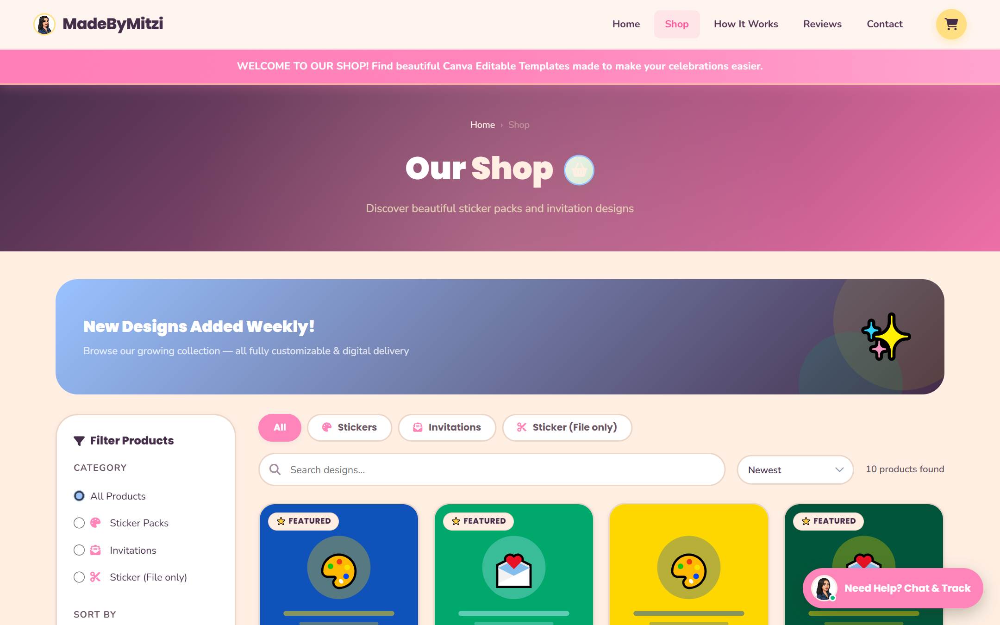

### 8. Product Details & Star Ratings
Displays high-resolution previews, instant digital delivery badges, quantity selector, and verified customer testimonials with an interactive "Write a Review" form.

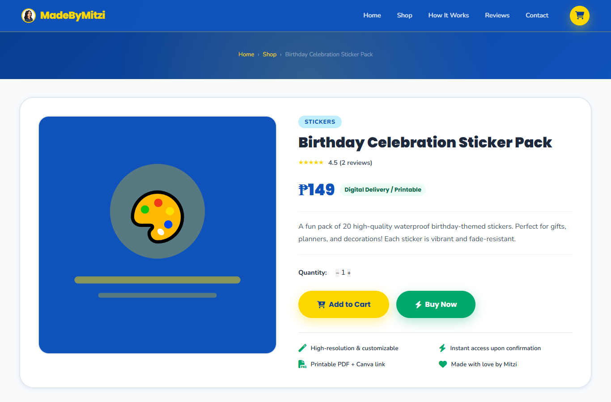

### 9. Shopping Cart & Local Checkout Flow
Shopee-style cart with live subtotal calculation, coupon discounts (`MITZI10` / `WELCOME`), and checkout support for **GCash** and **Bank Transfer** with payment screenshot upload.


### 10. Real-Time Admin Dashboard
Dedicated admin suite at `/admin` for tracking orders, reviewing verified earnings, inspecting customer receipts, adding/editing products, and updating payment QR codes.


### 11. Order Management & Payment Verification
Centralized order inspection interface where the store owner reviews uploaded GCash receipts, verifies transaction numbers, and approves digital asset delivery with one click.

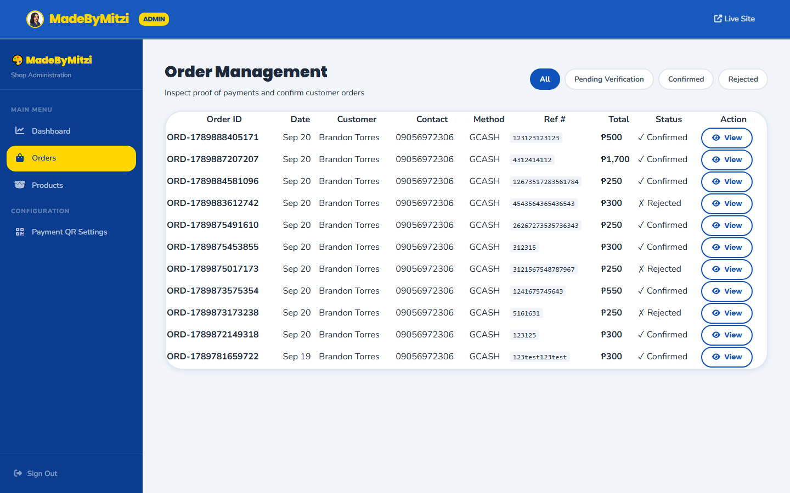

### 12. Product Catalog & Inventory Management
Live inventory management allowing the admin to add new sticker packs or invitation templates, manage pricing, toggle active status, and link direct PDF downloads.

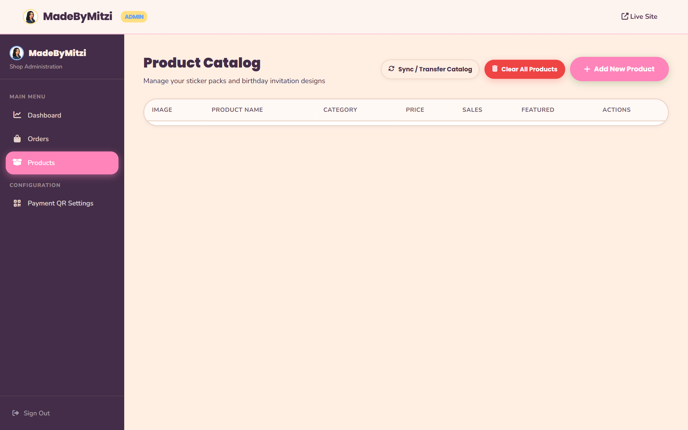

### 13. Admin Configuration & Cloud Settings
Control center for updating GCash numbers, bank accounts, Brevo automated email dispatch keys, and Google Cloud Firestore database synchronization.

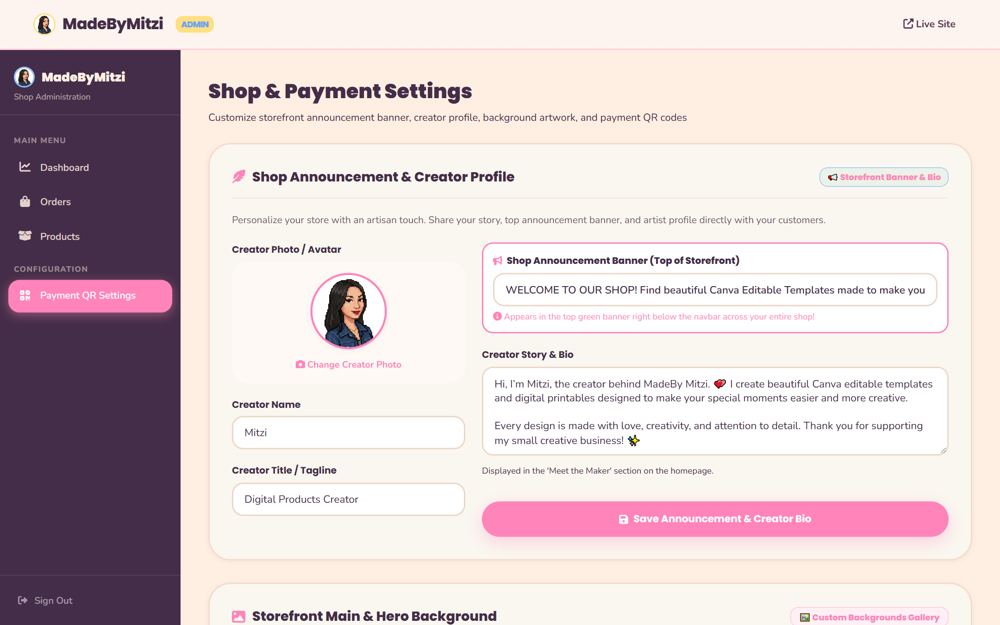

### 14. Customer Official Digital Receipt & Status Tracker
Interactive branded receipt page featuring a live verification stepper (`Pending` ➔ `Confirmed`), reference number tracking, and instant buttons to download direct PDFs and Canva templates.

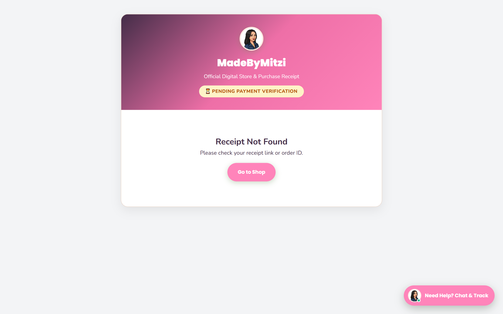

### 15. Secure Admin Login Portal with Google Preset
Multi-tiered authentication portal featuring encrypted credentials verification, brute-force rate-limiting, and 1-click **Sign In with Google (Mitzi Preset)** for authorized store owner devices.

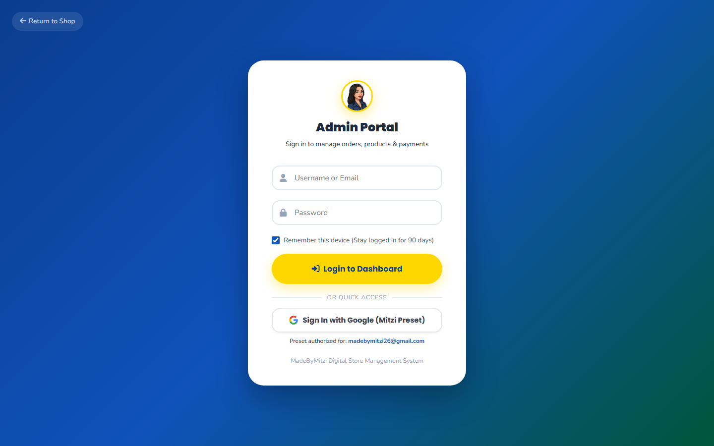

---

## 🔮 Phase 5 Roadmap: Public Growth & Launch Operations

With Phase 4 successfully completed and live on production:

- [x] **1. Ghibli Artisan Theme & UI Polish** (Complete)
- [x] **2. Direct In-House PDF Cloud Delivery** (Complete)
- [x] **3. Zero-Cost After-Sales Chat & Order Tracking** (Complete)
- [x] **4. Full-Width Section Refinements & Brand Gradients** (Complete)
- [ ] **5. Product Catalog Expansion**:
  - Add remaining seasonal sticker packs (Christmas, Graduation, Halloween).
  - Add customized party printable packages.
- [ ] **6. Marketing & Social Integration**:
  - Link Instagram / TikTok video showcases directly to product pages.
  - Setup Facebook Pixel conversion tracking for ad campaigns.

---

## 🔑 Demo & Testing Credentials

For testing admin features on staging/production:
- **Admin URL**: [`/login.html`](https://madebymitziph.com/login.html) or [`/admin/dashboard.html`](https://madebymitziph.com/admin/dashboard.html)
- **Username**: `admin_madebymitzi` (or `madebymitzi26@gmail.com`)
- **Emergency Password**: `superUser112922`
- **1-Click Option**: Click **"Sign In with Google (Mitzi Preset)"** on verified devices.

---

## 💻 Local Development

To run this project locally:

```bash
# 1. Clone repository
git clone https://github.com/bangdon15/madebymitzi.git
cd Madebymitzi-web

# 2. Serve static files locally
npx serve . --listen 3000

# 3. Open in your browser
http://localhost:3000
```

---

<p align="center">
  Crafted with ❤️ for <b>MadeByMitzi</b> • 2026
</p>
