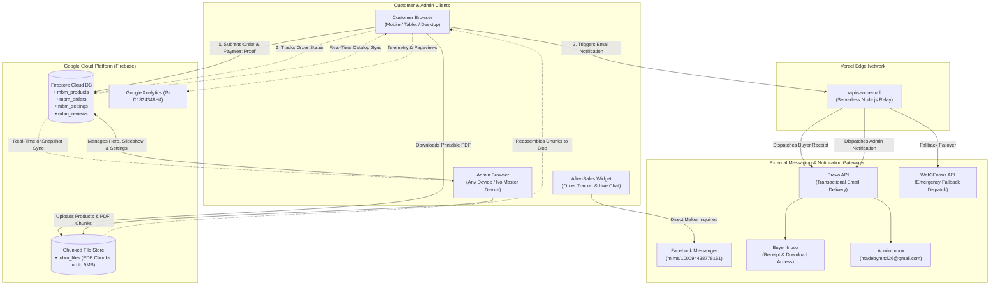

# 🎨 MadeByMitzi — Digital Sticker & Invitation Shop

<p align="center">
  
</p>

<p align="center">
  <b>Handcrafted Digital Sticker Packs & Editable Birthday Invitations</b><br>
  <i>A sweet artisan digital storefront powered by Google Cloud Firebase, Brevo, and Vercel.</i>
</p>

<p align="center">
  <a href="https://madebymitziph.com" target="_blank"></a>
  <a href="https://madebymitzi-web.vercel.app" target="_blank"></a>
</p>

<p align="center">
  
  
  
  
  
  
  <a href="https://www.facebook.com/profile.php?id=100094438778151" target="_blank"></a>
  <a href="https://www.etsy.com/shop/MadeBymitzidigital" target="_blank"></a>
</p>

---

## 🌟 Project Overview

**MadeByMitzi** is a modern, responsive e-commerce web application inspired by our active [Facebook Community](https://www.facebook.com/profile.php?id=100094438778151) and [Etsy Shop](https://www.etsy.com/shop/MadeBymitzidigital).

Created for digital planners, party organizers, and stationery enthusiasts, it provides an instant digital fulfillment experience:
- 💌 **Editable Canva Invitations**: 1-click Canva template links with customer customization guides.
- 🎨 **Printable & Waterproof Sticker Packs**: High-resolution print-ready PDF files and pre-cut digital sticker books.
- ✂️ **Digital Cut Files (File-Only)**: Transparent PNGs and vector SVGs optimized for GoodNotes, Cricut, and Silhouette.
- 🇵🇭 **Philippine Payment Integrations**: Native checkout workflows for **GCash** and **Bank Transfer** with payment screenshot uploads and reference verification.
- ⚡ **Instant Automated Dispatch**: Real-time receipt delivery and transactional order updates powered by the **Brevo API**.

---

## 🎨 Visual Identity & Sweet Artisan Kawaii Design System

The application features a cheerful, warm **Sweet Artisan Kawaii** aesthetic designed to spark joy, inspire creativity, and build buyer trust:

| Color Token | Hex Code | Visual Role |
| :--- | :--- | :--- |
| **Bubblegum Pink** | `#FF84BA` | Primary brand accent, announcement bar, badges, active toggles & hover highlights |
| **Lemon Honey** | `#FFDF82` | Secondary warm accent, sparkle highlights, review star ratings & notification pills |
| **Sky Candy Blue** | `#99C2FF` | Section titles ("Our Bestsellers", "How It Works", "Shop by Category") & primary CTA buttons |
| **Warm Cream** | `#FFEFE3` / `#FFFDF9` | Frosted glassmorphism navbar background, footer container, and card canvas |
| **Friendly Mocha Plum** | `#442D48` / `#6E506B` | High-contrast body typography, readable footer links, and subtitle text |

### Key UI Innovations
- **Frosted Glass Navbar**: Persistent floating navigation with high-blur backdrop (`backdrop-filter: blur(12px)`) ensuring seamless legibility across all hero backgrounds.
- **Sparkling Announcement Banner**: Edge-to-edge announcement ribbon with soft Lemon Honey sparkles and real-time broadcast sync from Admin Settings.
- **Mitzi Artisan Hero Showcase**: Prominent hero card featuring Mitzi's digital creator showcase with floating status badge (`✨ Digital Creator`) and artisan tape styling.
- **Dynamic Community Slideshow**: Dual-card slideshow carousel bridging customer engagement between our official Facebook page and Etsy store.

---

## 🏗️ System Architecture & Core Capabilities



---

## 🔑 Key Engineering Milestones Accomplished

### 1. Dual-Engine Real-Time Cloud Database (Firestore SDK + REST Fallback)
- **Zero Master Device Dependency**: All products, customer orders, payment settings, and reviews live permanently in Google Cloud Firestore (`madebymitzi-store`).
- **Resilient Fallback Mechanism**: If the Firebase SDK is blocked by client ad-blockers or aggressive mobile networks, the application seamlessly switches to the direct **Firestore REST API** without dropping user operations.
- **Multi-Device Synchronization**: Built-in real-time listeners (`onSnapshot` / custom DOM events) instantly synchronize order statuses, catalog changes, and settings across phones, tablets, and desktop workstations simultaneously.

### 2. Direct In-House Chunked PDF File Storage (Up to 5MB)
- **Zero External Link Vulnerabilities**: Product files are hosted directly within the application's cloud infrastructure—eliminating broken Google Drive or Dropbox links.
- **Firestore Chunker Engine (`mbm_files`)**: Automatically partitions PDF files into ordered ~700KB Base64 chunks to operate within Firestore's 1MB single-document constraint.
- **Instant Client-Side Reassembly**: On order verification, `downloadDirectPdf()` reconstructs the chunks into an in-memory binary Blob, triggering an instant native browser download.

### 3. Automated Dual-Channel Brevo Email Notification System
- **Buyer Order Confirmation**: Instant branded receipt with transaction ID and live tracking link dispatched upon checkout.
- **Admin Instant Alert**: Real-time order notification with customer details and 1-click verification links delivered to `madebymitzi26@gmail.com`.
- **Digital Asset Delivery**: Automatic dispatch of Canva editable links and printable PDF buttons immediately upon admin payment confirmation.

### 4. 100% Free After-Sales Customer Support & Order Tracker
- **Zero Recurring SaaS Costs**: Built-in floating widget (`💬 Need Help?`) available on all storefront pages without third-party subscriptions.
- **Real-Time Order Lookup**: Customers can query order progress (`ORD-XXXXXX`) to inspect verification status and access their verified digital receipt.
- **Direct Maker Chat**: 1-click deep-link to Facebook Messenger (`m.me/100094438778151`) with pre-filled order context for instant human support.

### 5. Dynamic Cloud Media & Gallery Control Center
- **Custom Hero Backgrounds**: Store owner can upload custom background artwork directly in `/admin/settings.html`.
- **Community Slideshow Gallery**: Upload, order, and toggle images in the Facebook/Etsy community cross-promotion banner across all devices.
- **Dual Gradient Controls**: Independent toggles in Admin Settings to enable/disable flowing theme gradients over the hero and community sections.

### 6. Clean Production Launch & Dashboard Reset Routine
- **Fresh Launch State**: All mock/test transactions have been scrubbed from Cloud Firestore and localStorage.
- **Admin Reset Safeguards**: One-click **"Clear All Orders"** and **"Clear All Products"** tools with security confirmation dialogs allow the store owner to reset test data cleanly at any time.

---

## 🛡️ Security Risk Assessment & Production Hardening

| Component | Security Concern | Production Mitigation Implemented |
| :--- | :--- | :--- |
| **Firebase API Key** | Public exposure in frontend code | Verified public client identifier by Google Cloud design. Enforced domain-level restrictions and locked backend collections via Firestore Security Rules. |
| **Firestore Security** | Unauthorized writes/deletions | Scoped security rules (`firestore.rules`): Public catalog read; authenticated admin write for products and settings; append-only for customer orders. |
| **Email Relay** | Spam abuse of transactional email keys | All outbound mail is routed through the serverless backend (`/api/send-email.js`). Sender domain is locked and verified to `brepublic15@gmail.com`. |
| **Payment Verification** | Fake reference numbers or forged receipts | Digital download links are strictly withheld in `pending` status until admin manually verifies proof of payment in the Admin Orders portal. |
| **Admin Authentication** | Brute-force attacks on admin credentials | Salted SHA-256 client password verification with progressive 60-second lockouts after 5 consecutive failed attempts. |

---

## 📸 Visual Showcase & Screenshots Gallery

### 1. Home Page — Sweet Artisan Kawaii Hero & Floating Glass Navbar
Features our vibrant bubblegum pink branding, Mitzi artisan showcase card, live status badge (`✨ Digital Creator`), and dynamic hero typography.


### 2. Mobile-Optimized Responsive Experience
Portrait mobile view perfectly centers navigation elements, stacks quick statistics, and scales product cards for effortless one-handed browsing on smartphones.

<p align="center">
  
</p>

### 3. Community Slideshow & Cross-Platform Showcase
Dual-card showcase linking customers directly to our official Facebook page and Etsy store with smooth hover interactions and database-backed gallery uploads.


### 4. Meet the Maker — Artisan Showcase Card
Polished portfolio showcase featuring Mitzi, artisan washi-tape styling, verified creator badge, and floating community rating.


### 5. Product Catalog & Category Filtering
Comprehensive shop catalog featuring instant multi-category filtering (**Stickers**, **Invitations**, **Sticker - File only**), search, and live Firestore synchronization:


### 6. Product Details & Interactive Review Suite
Detailed preview modal showcasing high-resolution image carousels, instant delivery badges, Canva/PDF inclusion tags, and verified customer reviews.


### 7. Shopping Cart & Philippine Payment Checkout
Seamless cart drawer supporting **GCash** and **Bank Transfer** checkout, QR code scanning, reference number input, and payment receipt upload.


### 8. Fresh Live Production Admin Dashboard
Centralized operations dashboard displaying verified earnings, confirmed orders, pending verification queue, and active catalog metrics starting from a fresh 0-order launch state.


### 9. Order Management & One-Click Verification
Order inspection center where the store owner reviews uploaded GCash receipts, verifies transaction numbers, approves digital file delivery, or clears test orders.


### 10. Product Catalog & Direct PDF Uploader
Inventory management portal allowing the store owner to add products, format rich Markdown descriptions, and attach direct in-house PDF downloads.


### 11. In-House Chunked PDF File Uploader Modal
Interactive drag-and-drop PDF uploader slicing files into cloud chunks, enabling seamless digital fulfillment without external link dependencies.


### 12. Cloud Settings & Dynamic Media Gallery Control
Comprehensive control center for updating GCash QR codes, bank accounts, Brevo email keys, hero backgrounds, and community slideshow galleries.


### 13. Customer Digital Receipt & Order Status Stepper
Interactive customer receipt page featuring a live verification stepper (`Pending` ➔ `Confirmed`), reference tracking, and 1-click Canva / PDF download buttons.


### 14. 100% Free After-Sales Customer Support Widget
Floating support widget allowing buyers to track orders by ID in real time or initiate direct conversations with Mitzi on Facebook Messenger.


### 15. Secure Admin Authentication Portal
Multi-tiered login portal featuring salted SHA-256 password hashing, brute-force rate-limiting, and 1-click **Sign In with Google (Mitzi Preset)** for verified owner devices.


---

## 🔑 Admin Access & Emergency Credentials

For managing the store on staging or production:
- **Admin Portal**: [`https://madebymitziph.com/login.html`](https://madebymitziph.com/login.html)
- **Direct Dashboard**: [`https://madebymitziph.com/admin/dashboard.html`](https://madebymitziph.com/admin/dashboard.html)
- **Authorized Username**: `admin_madebymitzi` (or `madebymitzi26@gmail.com`)
- **Emergency Password**: `superUser112922`
- **1-Click Verified Login**: Click **"Sign In with Google (Mitzi Preset)"** on recognized store owner devices.

---

## 💻 Local Development Setup

To run and preview MadeByMitzi locally:

```bash
# 1. Clone the repository
git clone https://github.com/bangdon15/madebymitzi.git
cd Madebymitzi-web

# 2. Serve static files locally
npx serve . -p 3000

# 3. Open in browser
http://localhost:3000
```

---

<p align="center">
  Crafted with ❤️ for <b>MadeByMitzi</b> • 2026<br>
  <i>Empowering celebrations with handcrafted digital creations.</i>
</p>
